# 🏢 Active Directory, Group Policy & Zabbix Monitoring
## Hybrid Enterprise IT Lab — Full Documentation

> **Domain:** `corp.corpnet.com` &nbsp;|&nbsp; **DC:** `CORP-DC-01` @ `10.0.0.10` &nbsp;|&nbsp; **Client:** `DESKTOP-F8CRF32` @ `10.0.0.20` &nbsp;|&nbsp; **NOC:** Zabbix @ `10.0.0.24`
>
> 📎 *Phase 1 — Zabbix base setup on Ubuntu 24.04: [View Zabbix Repo](#)*

---

## 🧠 The Story

After getting Zabbix up and monitoring my Ubuntu server, I asked myself the question every enterprise sysadmin deals with daily: *how do you actually manage and monitor Windows machines at scale?*

The answer is **Active Directory + Group Policy + Zabbix** — the backbone of enterprise IT in organisations worldwide. Instead of just reading about it, I built the whole thing from scratch: a domain controller, a joined Windows 10 client, multiple GPOs doing real work, a security delegation model, and a full Zabbix monitoring layer watching everything in real time.

This isn't a tutorial follow-along. Every problem here was real. Every fix was earned.

---

## 🗺️ Architecture

```
┌─────────────────────────────────────────────────────────────────┐
│                   VirtualBox — 10.0.0.0/24                      │
│                                                                 │
│  ┌──────────────────────┐      ┌──────────────────────────┐    │
│  │  CORP-DC-01          │      │  DESKTOP-F8CRF32         │    │
│  │  Windows Server 2022 │◄─────│  Windows 10 Build        │    │
│  │  10.0.0.10           │Domain│  19045.2965              │    │
│  │                      │ Join │  10.0.0.20               │    │
│  │  ● Active Directory  │      │                          │    │
│  │  ● DNS Server        │ GPO ►│  ● corp.corpnet.com ✅   │    │
│  │  ● GPMC              │      │  ● Wallpaper GPO         │    │
│  │  ● SMB Shares        │ SMB ►│  ● H:\ drive mapped      │    │
│  │  ● Zabbix Agent 2    │      │  ● CMD blocked           │    │
│  └──────────────────────┘      │  ● Control Panel blocked │    │
│            │                   └──────────────────────────┘    │
│            │ TCP 10050                                          │
│            ▼                                                    │
│  ┌──────────────────────┐                                       │
│  │  Ubuntu 24.04 NOC    │                                       │
│  │  Zabbix 7.0.23 LTS   │                                       │
│  │  10.0.0.24           │                                       │
│  │  ● 2 hosts monitored │                                       │
│  │  ● 249 active items  │                                       │
│  │  ● 3.47 values/sec   │                                       │
│  └──────────────────────┘                                       │
└─────────────────────────────────────────────────────────────────┘
```

---

## 📋 What Was Built

| Feature | Details |
|---------|---------|
| Domain | `corp.corpnet.com` |
| Domain Controller | `CORP-DC-01` (Windows Server 2022) |
| Client Machine | `DESKTOP-F8CRF32` (Windows 10 Build 19045.2965) |
| AD Security Group | `GS-IT-Staff` — delegated user management rights |
| GPO 1 | `company Wallpaper` — desktop wallpaper via UNC path |
| GPO 2 | `security_lockdown_policy` — CMD + Control Panel blocked for `hruser1` |
| GPO 3 | `Mapped_drive_policy` — `H:` → `\\10.0.0.10\CompanyData` |
| SMB Share | `CompanyData` hosted on DC, accessed by domain users |
| Zabbix | 7.0.23 LTS — 2 hosts, 249 items, 3.47 values/sec |

---

## 📖 Phase 1 — Active Directory & Delegation of Control

In any real org, you don't give every IT person Domain Admin — that's a security disaster. Instead, you delegate specific permissions to specific groups using the **Delegation of Control Wizard**.

I created `GS-IT-Staff` and gave them exactly what helpdesk needs:
- ✅ Create, delete, and manage user accounts
- ✅ Reset passwords and force change at next logon
- ❌ GPO management, group creation — not their job

**Selecting `GS-IT-Staff` in the Delegation Wizard**


**Delegating only necessary tasks — principle of least privilege in practice**


---

## 📖 Phase 2 — Joining Windows 10 to the Domain

Critical gotcha: **client DNS must point to the DC** (`10.0.0.10`) before anything works.

**Step 1 — Enter domain name**


**Step 2 — Authenticate**


**Step 3 — Success**


**Step 4 — Reboot**


**Verification — `ipconfig` showing `admin1.CORP` session, IP `10.0.0.20`**


**Verification — `systeminfo` confirming `Domain: corp.corpnet.com` | `Logon Server: \\CORP-DC-01`**


---

## 📖 Phase 3 — GPO 1: Corporate Desktop Wallpaper

Wallpaper pushed via UNC path: `\\10.0.0.10\CompanyData\Wallpaper` | Style: **Fill**

**GPO editor — wallpaper policy being configured**


**GPO editor — UNC path and Fill style set**


**SMB share permissions — both Share + NTFS must be set**


**Client result — GPO applied, image not found (white rectangle)**


> White rectangle = policy reached client ✅ | Image file missing from share ❌ — two separate problems. Real troubleshooting exhibit.

---

## 📖 Phase 4 — GPO 2: Security Lockdown Policy

Targeted at `hruser1@corp.corpnet.com` via Security Filtering. Other users unaffected.

| Policy | Setting |
|--------|---------|
| Prohibit access to Control Panel | Enabled |
| Prevent access to command prompt | Enabled |

**Control Panel restriction — before**


**Control Panel restriction — enabled**


**CMD restriction — enabled**


**GPMC — policy scoped to `hruser1` only**


**Full policy settings summary**


**Client proof — CMD blocked**


**Client proof — Control Panel blocked**


---

## 📖 Phase 5 — GPO 3: Mapped Network Drive

`Mapped_drive_policy` — maps `H:` → `\\10.0.0.10\CompanyData` automatically on login.

**Drive Maps in Group Policy Management Editor**


**Client — drive visible in File Explorer**


---

## 📖 Phase 6 — Zabbix Monitoring: DC1 Live Data

Zabbix Agent 2 installed on DC1, TCP 10050 opened in Windows Firewall, host added to Zabbix. Both hosts turned green immediately.

### 🖥️ Global Dashboard — 2 Hosts Available

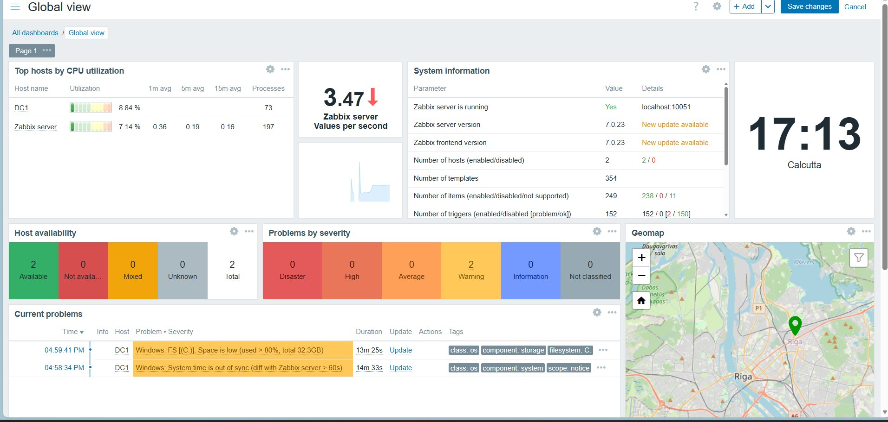

> **2 hosts 🟢** | Zabbix 7.0.23 | 249 items | 3.47 values/sec | 2 active warnings on DC1

---

### 📋 DC1 Full Metrics List

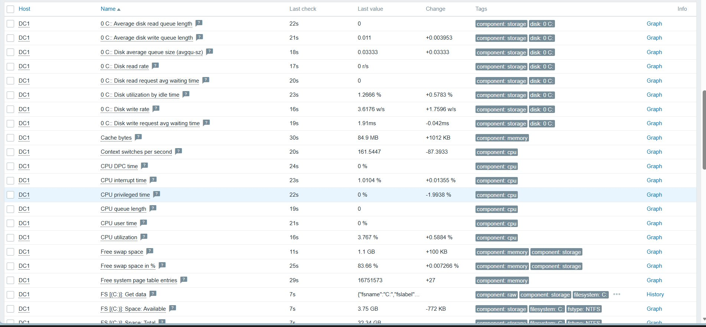

> All metrics updating every 7–30 seconds — CPU, disk, memory, filesystem, network

---

### 📊 CPU Utilization — Live Graph

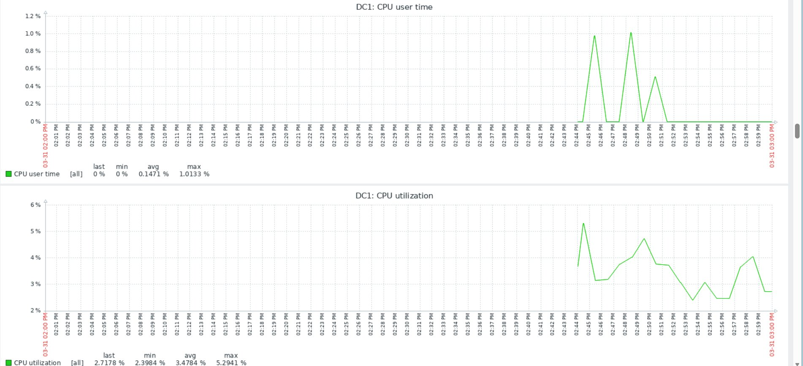

> **avg 3.4784% | max 5.2941%** — healthy Domain Controller workload

---

### 📊 CPU User Time

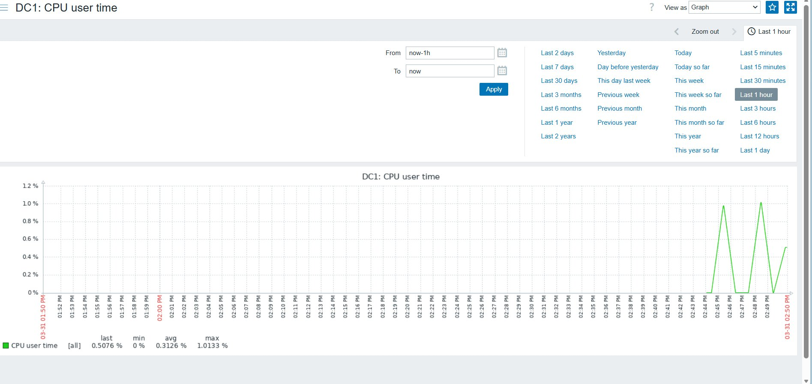

> User-space CPU: avg 0.3126%, max 1.0133%

---

### 💾 Disk I/O — Read/Write Queue

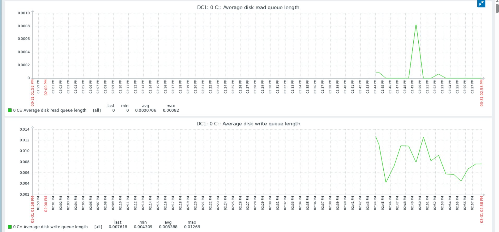

---

### 💾 Disk Waiting Times & Rates

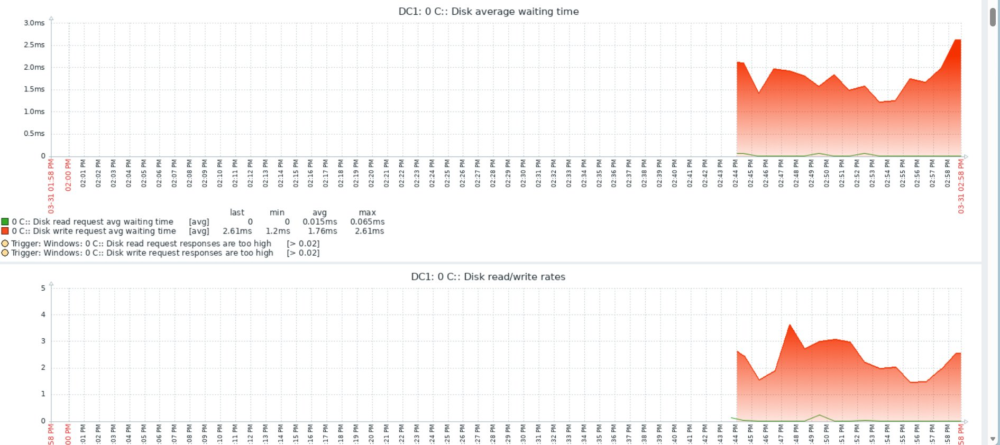

> Write request avg wait: **1.76ms avg, 2.61ms max**

---

### 💾 Disk Write Rate

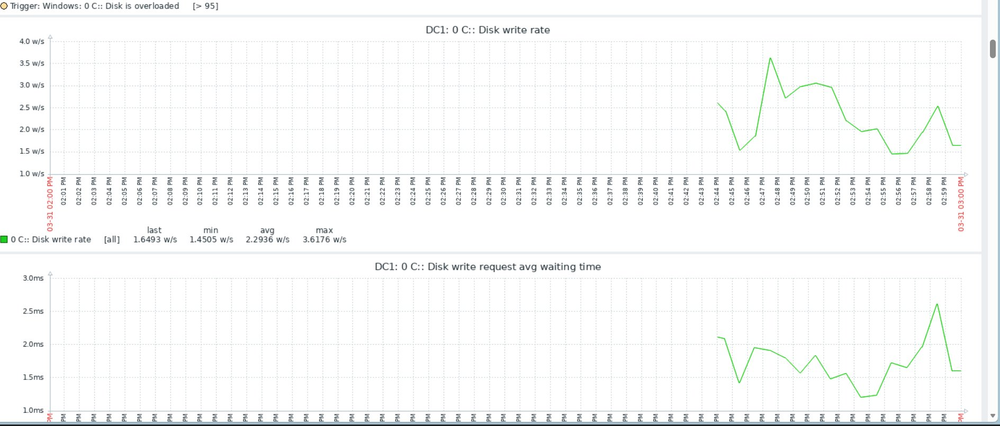

> **2.2936 w/s avg, 3.6176 w/s max**

---

### 💾 Disk Utilization

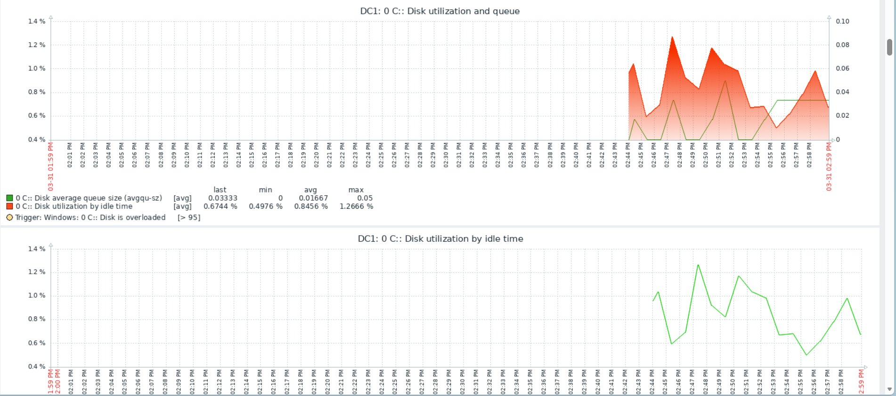

> Idle time utilization: 0.8456% avg — disk mostly idle ✅

---

### 🔴 Disk Space Alert — Real Monitoring Catching a Real Problem

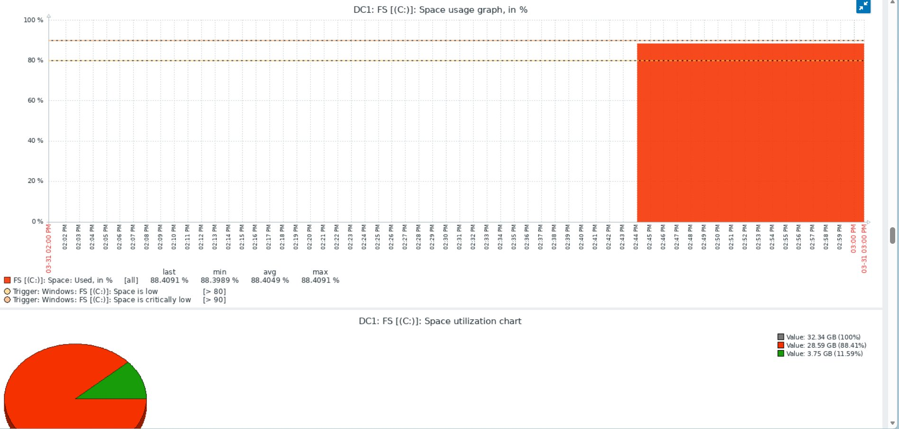

> **C: drive at 88.4% used** (28.59 GB of 32.34 GB) — Zabbix threshold breached at 80%, warning fired automatically. This is exactly what enterprise monitoring exists for.

---

### 🌐 Network Traffic

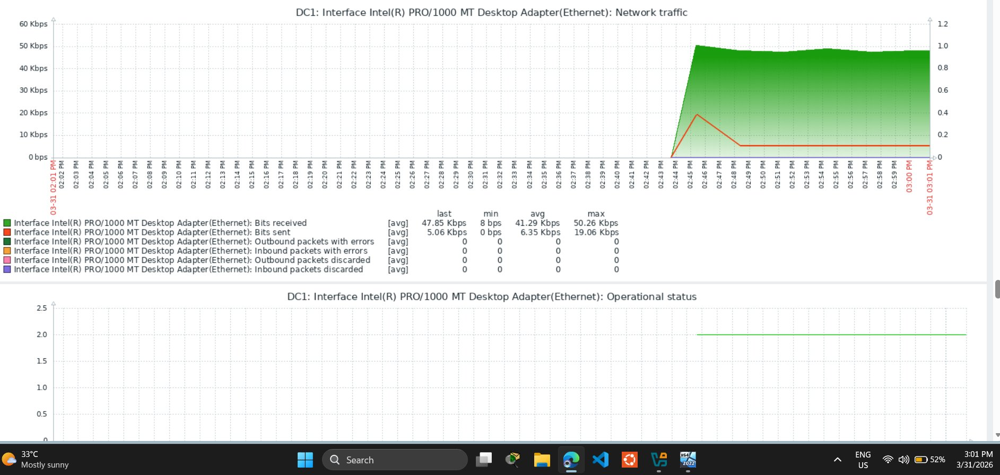

> **41.29 Kbps received avg** | 6.35 Kbps sent | Zero packet errors | Interface UP ✅

---

### 🧠 Memory & System Activity

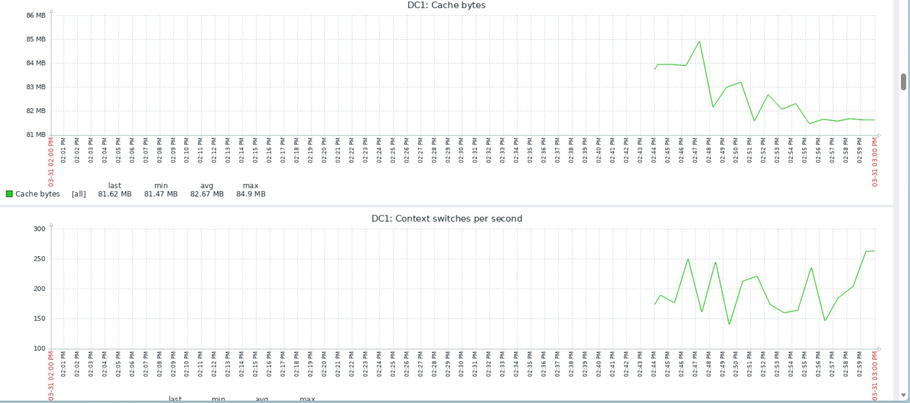

> Cache bytes: **82.67 MB avg** | Context switches: 150–250/sec — normal DC workload

---

## 🔧 Troubleshooting Log

| # | Problem | Cause | Fix |
|---|---------|-------|-----|
| 1 | Domain join fails | Client DNS not pointing to DC | Set DNS to `10.0.0.10` first |
| 2 | Wallpaper shows white rectangle | Image file missing from SMB share | Place valid file at exact UNC path |
| 3 | SMB Access Denied | NTFS permissions not set | Add Read for Authenticated Users at Share + NTFS level |
| 4 | GPO not applying | Policy refresh interval | Run `gpupdate /force` + `gpresult /r` |
| 5 | Zabbix host red/unavailable | TCP 10050 blocked by Windows Firewall | Create custom inbound firewall rule |
| 6 | NTP sync warning — GUI greyed out | Org policy locked time settings | Used `w32tm` + PowerShell to force sync |
| 7 | Disk space alert on DC1 | C: drive at 88.4% — threshold >80% | Active alert — clean up disk or expand VHD |

---

## 💼 Skills Demonstrated

- Active Directory setup, domain promotion, DNS integration
- Delegation of Control — least privilege administration
- GPO creation, linking, scoping, Security Filtering
- SMB file share with dual-layer permission model
- Group Policy Preferences — Drive Maps automation
- Windows 10 domain-join process end-to-end
- Zabbix Agent 2 deployment on Windows
- Windows Firewall custom inbound rule management
- NTP synchronization via PowerShell
- Real-time monitoring: CPU, disk, memory, network
- Alert threshold management and incident diagnosis

---

## 🔗 Related Projects

- 📡 [Phase 1 — Zabbix Monitoring Lab](#) — Ubuntu 24.04 + LAMP + Zabbix 7.0 LTS
- 🔒 Coming next: Ansible automation + security hardening GPOs

---

*Built hands-on in VirtualBox. Every error was real. Every fix was earned.*
